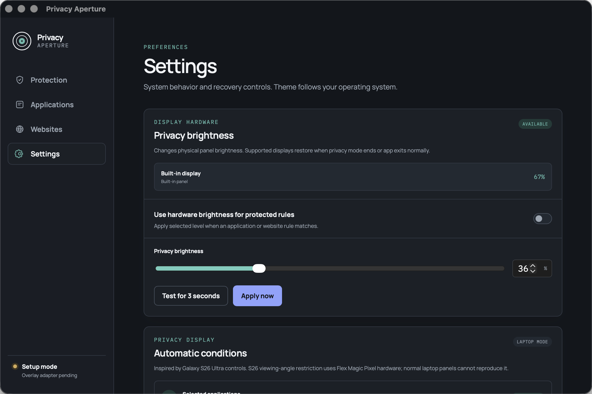

<div align="center">
  
  <h1>Privacy Aperture</h1>
  <p><strong>Keep private work private—even when the room is not.</strong></p>
  <p>
    Privacy Aperture automatically dims sensitive app windows when they become active,<br>
    then restores everything when you move away.
  </p>
  <p>
    
    
    
  </p>
  <p>
    <a href="#try-current-macos-prototype"><strong>Try current prototype</strong></a>
    · <a href="#what-works-today">See what works</a>
    · <a href="#roadmap">Roadmap</a>
  </p>
</div>



## Private app. Bright room. No brightness juggling.

Choose sensitive app once. Privacy Aperture watches only foreground application identity and responds locally:

1. Open protected app → its visible windows dim.
2. Keep working → pointer and keyboard pass through normally.
3. Switch away → dimming disappears automatically.

No account. No cloud. No telemetry. No screen capture.

## What works today

| Capability | Behavior |
|---|---|
| **App-window dimming** | Dims only visible windows belonging to matched macOS app. Surrounding desktop and other apps stay bright. |
| **Real hardware brightness** | Optional panel control at same physical level changed by Mac brightness keys. Disabled by default because hardware brightness affects whole display. |
| **Automatic rules** | Select an app that currently owns a visible standard window, choose 10–100% visibility, then let foreground changes apply and restore protection. |
| **Menu-bar command center** | Protect Current App, Peek, Pause/Resume, open settings, or quit with overlay and brightness cleanup. Closing settings keeps protection running. |
| **Startup and recovery** | Optional launch at login plus configurable global emergency shortcut. A second launch restores the existing settings window instead of starting another runtime. |
| **Maximum privacy** | Uses 10% app-window visibility and, when hardware mode is enabled, 10% panel brightness. This is not optical side-view blocking. |
| **Emergency recovery** | Pause protection or restore captured hardware brightness immediately. Three-second preview restores automatically. |
| **Local rule storage** | Versioned JSON stores user-created app IDs, hostnames, and visibility settings—nothing else. |

The application picker excludes processes without eligible on-screen windows, including most background helpers, extensions, and agents. Hidden, minimized, or other-Space apps appear after they own a visible standard window. Manual bundle-ID entry remains available.

### Two controls, two different jobs

| | Window overlay | Hardware brightness |
|---|---|---|
| Scope | Protected app windows only | Entire physical panel |
| Best for | Keeping other apps readable | Making whole display less visible |
| Input | Click-through | Normal system behavior |
| Default | Automatic app rule | Optional, off |

This distinction matters: software overlays can target one app; physical brightness cannot.

## Privacy promise

- No account, cloud sync, telemetry, ads, or network service.
- No page content, browsing history, window titles, full URLs, screenshots, or activity history.
- macOS app matching uses bundle identity. Picker eligibility and window placement use process ID and bounds only.
- Active browser context will remain memory-only and clear on disconnect.
- Product reduces casual shoulder-surfing. It cannot stop cameras, screenshots, close viewing, or replace physical privacy-filter hardware.

## Current support

| Platform / integration | Status |
|---|---|
| macOS app rules and app-window overlays | **Working prototype; live tested** |
| macOS built-in display brightness | **Working prototype; live tested** |
| Chromium website rules | Rule engine exists; extension and native host not connected yet |
| Windows brightness adapter | Source present; hardware QA pending |
| Linux backlight adapter | Source present; distro permissions and hardware QA pending |
| Signed installers / automatic updates | Not published yet |
| Wayland global app detection | Unsupported until compositor-specific integration exists |

Galaxy S26 Ultra Privacy display narrows viewing angles using dedicated panel hardware. Normal laptop panels cannot reproduce that optical effect in software. Privacy Aperture adopts useful control ideas—automatic conditions, quick restore, and Maximum privacy—without claiming impossible side-view blocking.

## Try current macOS prototype

> Signed public download does not exist yet. Current build is developer prototype. First release target: signed, notarized macOS DMG.

Requirements: Node.js 20.19+ or Node.js 22.12+, pnpm 11+, Rust stable, and [Tauri 2 prerequisites](https://v2.tauri.app/start/prerequisites/).

```sh
git clone https://github.com/SamirWagle/LaptopPrivacy.git
cd LaptopPrivacy
pnpm install
pnpm check
pnpm tauri dev
```

Need release instead of source build? Watch [GitHub Releases](https://github.com/SamirWagle/LaptopPrivacy/releases); first signed build will appear there.

## Roadmap

### Ship next

- **Focused-window mode** — when no privacy rule matches, keep the active front window bright and dim the surrounding desktop. Optional and off by default.
- **Settings UI V2** — clearer Protection, Applications, Websites, Focus, and Settings sections with onboarding and accessible live previews.
- **Chromium extension** — protect current hostname without content scripts or page injection.
- **Signed macOS DMG + auto-update** — safe two-click install after browser integration and release checks are complete.

### Then

- **Per-display profiles** — keep trusted display bright while dimming public-facing display.
- **Rule presets** — Finance, Messages, Work, and Maximum Privacy starting points.
- **Windows 10/11 and Linux X11 validation** — real-device overlay, brightness, packaging, and recovery tests.

### Later, only with reliable platform support

- Safari and Firefox integrations.
- GNOME/KDE Wayland adapters.
- Supported external-monitor DDC/MCCS control.
- Privacy-panel hardware integration when laptop vendors expose public APIs.

## Development checks

```sh
pnpm build
cargo test --manifest-path src-tauri/Cargo.toml
cargo clippy --manifest-path src-tauri/Cargo.toml --all-targets -- -D warnings
```

macOS hardware/desktop acceptance tests require active GUI session and run serially:

```sh
cargo test --manifest-path src-tauri/Cargo.toml reads_foreground_and_running_applications -- --ignored --test-threads=1
cargo test --manifest-path src-tauri/Cargo.toml automatic_control_changes_and_restores_panel_level -- --ignored --test-threads=1
```

<details>
<summary><strong>How it works</strong></summary>

- Tauri 2 settings shell with vanilla TypeScript UI.
- Rust core owns rules, state, local storage, brightness sessions, and recovery.
- `NSWorkspace` supplies foreground bundle identity without Accessibility access.
- CoreGraphics supplies target process window bounds without reading titles or content.
- Raw native black windows match those bounds, ignore input, and rebuild as windows move.
- IOKit is tried first for display brightness; built-in Apple panels use direct-distribution `DisplayServices` fallback when necessary.

</details>

## Contributing

Open issue with use case, platform, display model, and expected privacy behavior. Never include private app names, hostnames, screenshots, or credentials in diagnostics.

Every change uses feature branch and pull request. `main` is never direct-pushed or merged by automation.

---

<div align="center">
  <strong>Privacy should activate before somebody looks over your shoulder.</strong>
</div>
